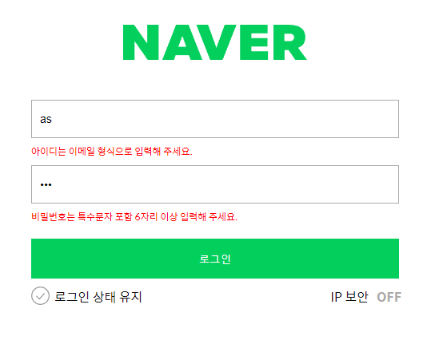
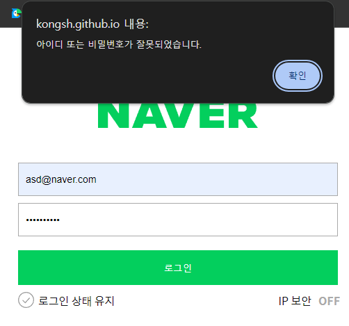

# 네이버 로그인 과제 보고서📃

멋사 프론트엔드 스쿨 12기 공세현입니다.

🔗2주차 과제 결과물 링크 : [NAVER_Login](https://kongsh.github.io/js-homework/naver_login/index.html)

🔗main.js 파일 링크 : [main.js](https://github.com/kongsh/js-homework/blob/main/naver_login/js/main.js)

과제에 대한 설명을 시작하겠습니다.🎈

## 목차🗂️

<span style="font-weight:bold">요구사항 & 계획📝</span>

- [요구사항](#요구사항)
- [계획](#계획)

<span style="font-weight:bold">구현 & 실행결과🚀</span>

- [코드 구현](#코드-구현)
- [실행 결과](#실행-결과)

<span style="font-weight:bold">소감✨</span>

## 요구사항 & 계획📝

### 요구사항

1. 아이디/비밀번호가 올바르게 입력되지 않았을 때, 주어진 `reg`함수로 `validation`해서 `error-message` 띄우기
2. 상태 변수 관리
3. 로그인 버튼 클릭 시 조건 처리

### 계획

1. 객체 `state`에 `input`에 입력된 값,로그인 여부의 상태 정보를 담습니다.
2. 각 `input cell`에 `input`이벤트 발생 시 `state`에 입력값을 담고, `validation` 이벤트 처리를 합니다.
3. 로그인 버튼에 클릭 이벤트 발생 시 객체 `state`와 `user`의 `id`,`pwd`값을 비교해 `login` 작업을 수행하고 실패 시 알림 메시지를 출력합니다.

## 구현 & 실행 결과🚀

### 코드 구현

```js
const idFormNode = getNode(".user-email");
const pwdFormNode = getNode(".user-password");
const loginButton = getNode(".btn-login");

manageInputState(idFormNode, "id", emailReg);
manageInputState(pwdFormNode, "password", pwReg);

loginButton.addEventListener("click", loginHandler);
```

실행 코드입니다.

`id`, `password` 각각의 `input cell`과 검증 함수를 `manageInputState`로 넘겨 이벤트 처리 등록 합니다.

그리고 로그인 버튼에 클릭 이벤트 발생 시 `loginHandler`에 의해 처리되도록 합니다.

---

#### manageInputState()

```js
function manageInputState(node, valueType, validFunction) {
  if (typeof node === "string") node = document.querySelector(node);
  if (!["id", "password"].includes(valueType)) throw new Error("manageInputState의 두번째 인자는 'id' 또는 'password'여야 합니다.");
  if (typeof validFunction !== "function") throw new TypeError("manageInputState의 세번째 인자는 함수형이어야 합니다.");

  const inputNode = node.querySelector("input");

  inputNode.addEventListener("input", (e) => {
    const inputValue = e.target.value;

    setInputValue(valueType, inputValue);

    if (!validFunction(inputValue)) toggleInputClass(inputNode, false);
    else toggleInputClass(inputNode, true);
  });
}
```

`input`이벤트 발생 시 `setInputValue()`로 입력값을 `state` 객체에 넣어줍니다.

그리고 `validFunction()`에 의해 검증 과정을 거치고 `toggleInputClass()`로 에러 메시지를 켜고 끕니다.

---

##### toggleInputClass()

```js
function toggleInputClass(node, isValid) {
  if (typeof isValid !== "boolean") throw new TypeError("toggleInputClass의 두 번째 인자는 Boolean 값이어야 합니다.");

  if (!isValid) node.classList.add("is--invalid");
  else node.classList.remove("is--invalid");
}
```

`isValid` 조건에 따라 `node`에 `is--invalid` 클래스를 `toggle`해 에러 메시지를 껐다 킵니다.

---

#### loginHandler()

```js
function loginHandler() {
  event.preventDefault(); // 일시적으로 폼 제출을 막았습니다.

  try {
    if (isLoginValid()) onLoginSuccess();
    else onLoginFailure();
  } catch (error) {
    onLoginError(error);
  }
}
```

버튼 클릭 시 `form` 제출 동작에 의해 에러 페이지로의 이동이 발생해 `event.preventDefault()`로 일시적으로 제출을 막았습니다.

그리고 `user`와 `state`의 `id`,`pwd`값을 비교하는 `isLoginValid()`를 통해 로그인 성공/실패 시에 서로 다른 처리를 해주었습니다.

또 비동기 통신으로 서버에서 ID,PWD값을 받아와 비교할 것을 생각해 `try-catch`문으로 시스템 장애발생 시의 처리를 해줬습니다.

---

### 실행 결과



ID, 비밀번호 입력 시 올바른 입력값 확인 후 에러 메시지를 표현한 화면입니다.



로그인 실패 시, 알림이 나오는 화면입니다.

## 소감✨

처음 JS로 컴포넌트의 몇가지 이벤트 처리 기능을 구현해 보았는데, 함수를 기능에 따라 나누고 받은 인자에 `validation` 처리를 해 주는 것이 익숙치 않아 시간을 많이 소요했습니다.

과제에 주어진 조건은 어느정도 맞췄다고 생각하지만 재사용 가능한 함수를 잘 분리했는지에 대해 확신이 없어서 피드백을 받은 뒤 부족한 점을 보완해 다음번에는 더 잘해보고 싶습니다.

읽어주셔서 감사합니다.🙏
