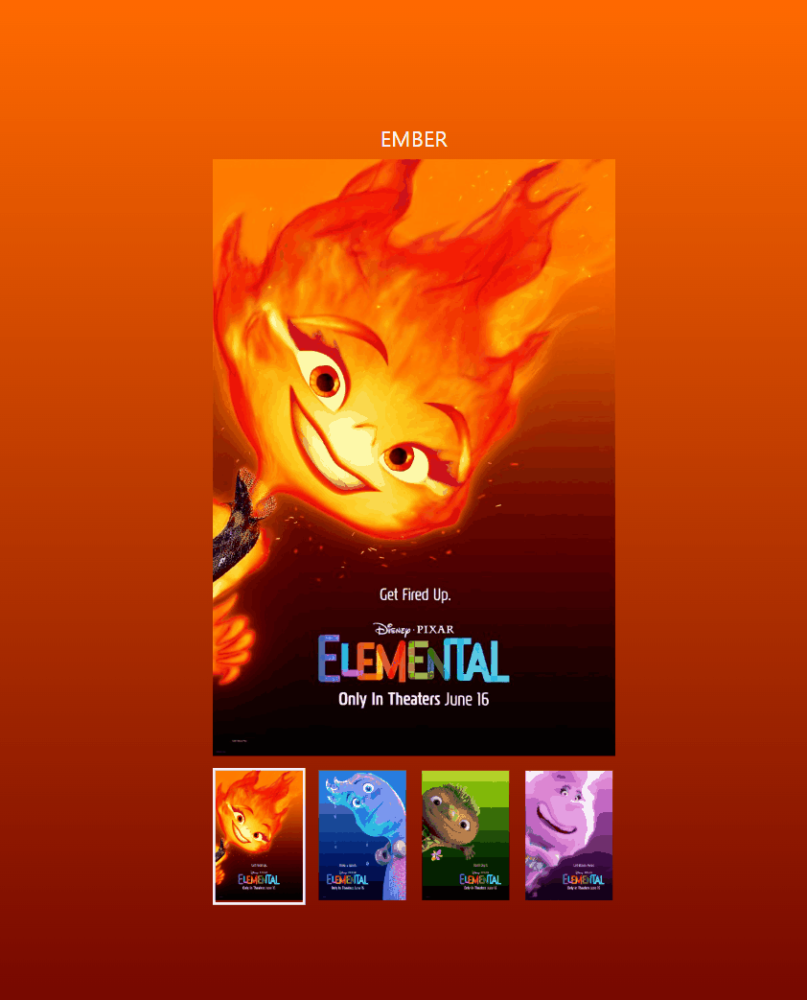
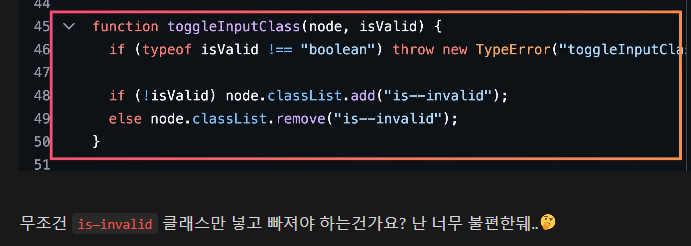

# 엘리멘탈 포스터 과제 보고서📃

멋사 프론트엔드 스쿨 12기 공세현입니다.

🔗3주차 과제 결과물 링크 : [Poster](https://kongsh.github.io/js-homework/poster/client/index.html)

🔗main.js 파일 링크 : [main.js](https://github.com/kongsh/js-homework/blob/main/poster/client/js/main.js)

과제에 대한 설명을 시작하겠습니다.🎈

## 목차🗂️

<span style="font-weight:bold">요구사항 & 계획📝</span>

- [요구사항](#요구사항)
- [계획](#계획)

<span style="font-weight:bold">구현 & 실행결과🚀</span>

- [코드 구현](#코드-구현)
- [실행 결과](#실행-결과)

<span style="font-weight:bold">소감 및 회고✨</span>

## 요구사항 & 계획📝

### 요구사항

1. 클릭 시 이벤트 처리에 이벤트 위임과 반복문을 활용
2. 이미지, 색상의 데이터는 `data.js`에서 불러오기
3. 함수 분리 및 가독성 좋은 코드로 리팩토링

### 계획

1. 이벤트 위임을 활용하기 위해 `nav` 태그에 클릭 이벤트를 걸고, 핸들링 함수에서 조건을 걸어 처리합니다.
2. `data.js`에 접근할 때 서버와 통신한다는 생각으로, `try-catch`문을 사용하고 통신 이전에 `if`문으로 조건을 확인한 후 통신합니다.
3. 재사용성과 가독성을 따지면서 함수를 분리합니다.

## 구현 & 실행 결과🚀

### 코드 구현

```js
import { data } from "./data.js";
import { AudioPlayer } from "./audio.js";

const nav = getNode(".nav");
const visualImg = getNode(".visual > div > img");
const nickName = getNode(".nickName");

let audioPlayer = null;

nav.addEventListener("click", handleNavImageClick);
```

실행 코드입니다.

`visualImg`와 `nickName`은 클릭 시마다 접근하게 되기 때문에 전역에 선언합니다.

`audioPlayer`는 재사용하기 위해 전역에 선언합니다.

이벤트 위임을 사용하기 위해 `nav`에 클릭이벤트를 걸고 `handleNavImageClick()`함수로 제어합니다.

---

#### handleNavImageClick()

```js
function handleNavImageClick(e) {
  if (!(e.target.tagName === "IMG")) return;
  const targetList = e.target.closest("li");
  const index = +targetList.dataset.index - 1;

  if (typeof targetList.dataset.index !== "undefined" && index >= 0) {
    try {
      if (index < data.length) {
        const { color, name, alt } = data[index];

        setBgColor(document.body, color);
        setImage(visualImg, name, alt);
        setNameText(nickName, name);

        playAudio(`./assets/audio/${name.toLowerCase()}.m4a`);
      } else throw new Error("index값이 데이터의 크기를 벗어났습니다.");
    } catch (err) {
      reportFunctionError(handleNavImageClick.name, err);
    }
  }

  this.querySelectorAll("ul > li").forEach((li) => {
    li.classList.remove("is-active");
  });

  targetList.classList.add("is-active");
}
```

우선, 이번 과제에서는 `nav`태그의 `img`태그를 눌렀을 때에만 이벤트가 발생하기 때문에, 함수명을 `handleNavImageClick`로 지었습니다.

통신으로 넘어가서, `index`가 음수이거나 없는 값일 때, 통신하지 않도록 했고, `index`가 `data`의 범위를 벗어났을 때 가져오지 않도록 했습니다.

마지막으로, 반복문을 통해 `is-active`의 제거 및 추가를 제어했습니다.

(반복문을 맨 밑에 둔 이유는 통신 이전에 코드를 최대한 줄이고 싶었기 때문입니다.)

---

##### reportFunctionError()

```js
function reportFunctionError(functionName, err) {
  if (typeof functionName !== "string") throw new Error("reportFunctionError함수의 첫번째 인자는 문자열이어야 합니다.");
  if (!(err instanceof Error)) throw new Error("reportFunctionError의 두번째 인수는 Error이어야 합니다.");

  console.log(`${functionName} 함수에서 서버와 통신 실패`, err);
  alert("서버와 통신에 실패했습니다...😥");
  throw new Error(`${functionName} 함수에서 서버와 통신에 실패했습니다.`);
}
```

재사용성과 코드 가독성을 고려해, `catch(err)` 부분에서 에러를 출력해줄 때의 함수를 작성했습니다.

---

##### playAudio()

```js
function playAudio(source) {
  if (typeof source !== "string") throw new TypeError("playAudio함수의 인자는 문자열이어야 합니다.");
  const ap = new AudioPlayer(source)

  if (!playingAP = null) playingAP = ap;
  else {
    if(playingAP.isPlaying()) playingAP.stop();
    playingAP = ap;
  }

  playingAP.play();
}

```

함수를 만든 시행착오를 설명드리겠습니다.🧐

맨 처음에는 이미지를 음성이 끝나기 전에 눌렀을 때, 이전의 음성이 멈췄으면 좋겠어서 이렇게 코드를 짰었습니다.

전역에 `playingAP`변수를 만들어서 음성이 재생중이면 `playingAP`를 멈추고 새 `ap`로 바꿔주는 방식입니다.

그러다 `<audio>` 태그가 어디에 만들어지는지, 이게 `stop()`을 하면 메모리에서 사라지는지 궁금해져서 찾아보았습니다.🤔

```js
// audio.js, AudioPlayer의 constructor

constructor(source) {
  this.#audio = document.createElement("audio");
  this.#audio.src = source;
}
```

먼저 태그가 HTML문서에 쌓이지 않았을까? 싶은 마음에 `AudioPlayer` 객체를 생성하고 개발자 도구의 HTML문서에서 `<audio>`태그를 찾아봤을 때, 찾지 못했습니다.😥

그래서 검색해보니 `<audio>`태그는 HTML문서에 자동으로 추가되지않고, 메모리에 존재하는 DOM 객체라는 사실을 알 수 있었습니다.💡

또, `stop()`을 한다고 태그가 메모리에서 사라지지 않는다는 사실도 알게되었습니다.😱

```js
function playAudio(source) {
  if (typeof source !== "string") throw new TypeError("playAudio함수의 인자는 문자열이어야 합니다.");

  if (!audioPlayer) audioPlayer = new AudioPlayer(source);
  else {
    audioPlayer.stop();
    audioPlayer = new AudioPlayer(source);
  }

  audioPlayer.play();
}
```

그래서 전역에 만들어 둔 `audioPlayer`가 없으면 새로 생성해주고, 있다면 재생을 멈추고 `audioPlayer`에 새 객체를 연결해서, 가비지 컬렉터가 이전의 `AudioPlayer`를 수거해가도록 했습니다.🎉

(`remove()`로 직접 삭제하는 방법도 있습니다.)

---

### 실행 결과



이미지를 클릭했을 때, 화면이 바뀌는 결과화면입니다.

~~WADE와 GALE이 너무 시끄러웠습니다.😵~~

## 소감✨

함수 정리와 가독성에 관련해서 고민이 많았습니다.

```js
setBgColor(document.body, color);
setImage(visualImg, name, alt);
setNameText(nickName, name);
```

이 코드를 updateUI()함수로 모을지 끝까지 고민했고, 묶은 함수가 다른곳에서 다시 쓰일까? 라는 생각에 묶지 않았습니다.

```js
this.querySelectorAll("ul > li").forEach((li) => {
  li.classList.remove("is-active");
});

targetList.classList.add("is-active");
```

이 코드도 이전의 피드백을 생각해서, 클래스를 지우고 토글하는 역할만 한다면, 굳이 함수로 따로 묶지 않았습니다.



저에게 이번 과제는 이전의 피드백들을(함수의 재사용성 고려, 함수명, 통신 이전에 조건문으로 비용 절감, 마크다운에 `gif` 사용) 적용해보면서 적응해나가고, 새로 배운 것들(이벤트 위임, `import/export`)을 적용해보며 복습해볼 수 있는 과제여서 하면서 많은것들을 배울 수 있었습니다.😊

읽어주셔서 감사합니다.🙏 좋은 하루 되세요.🥰
